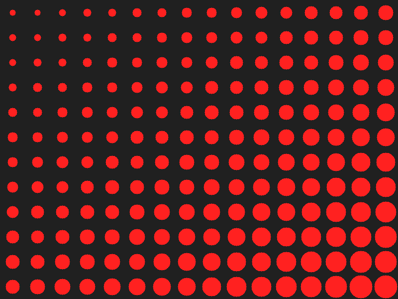
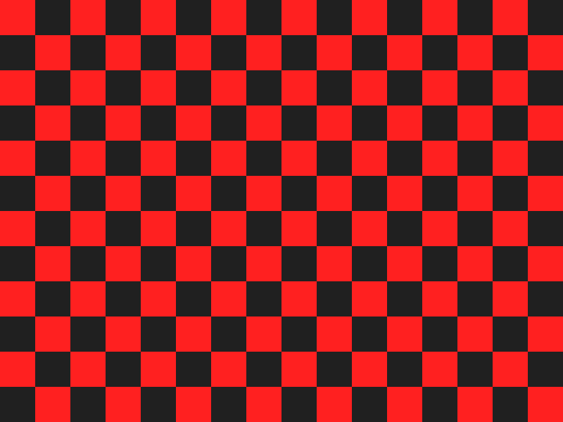
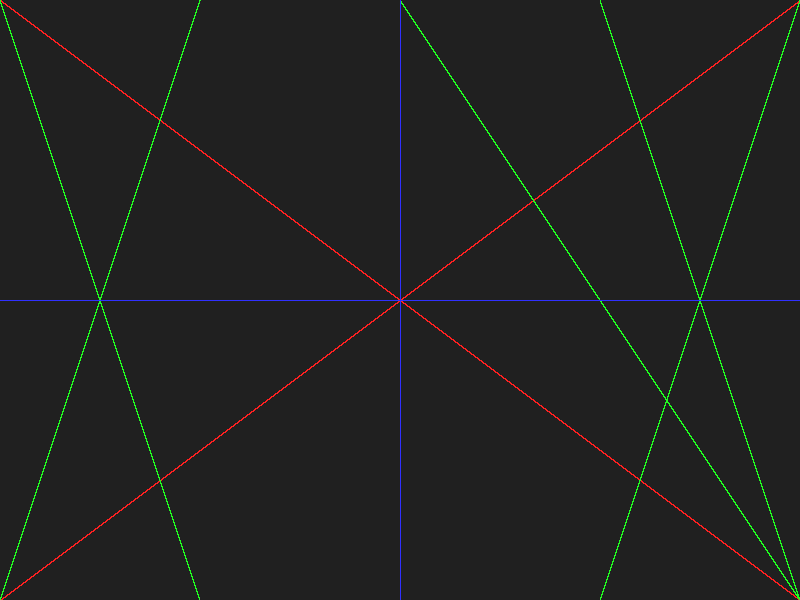
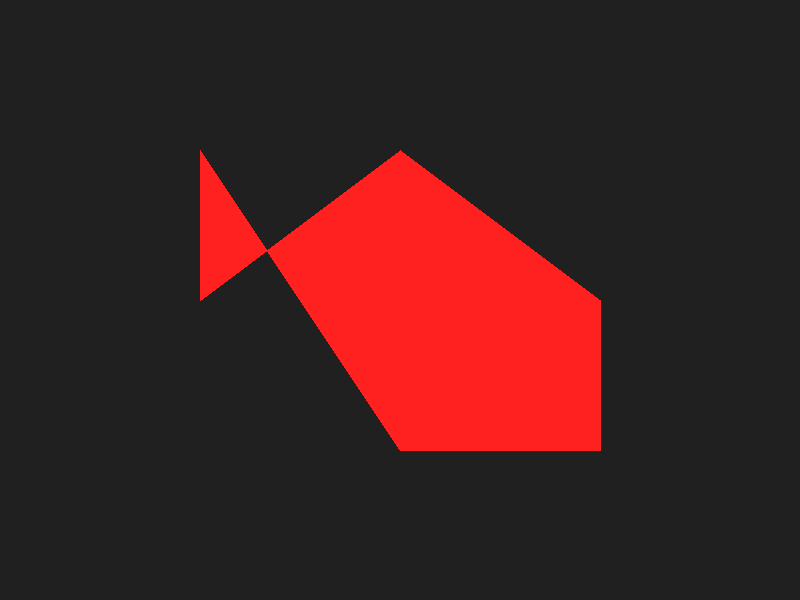
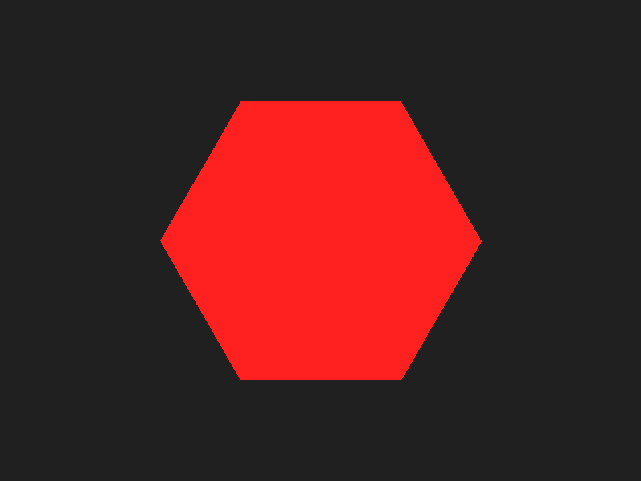
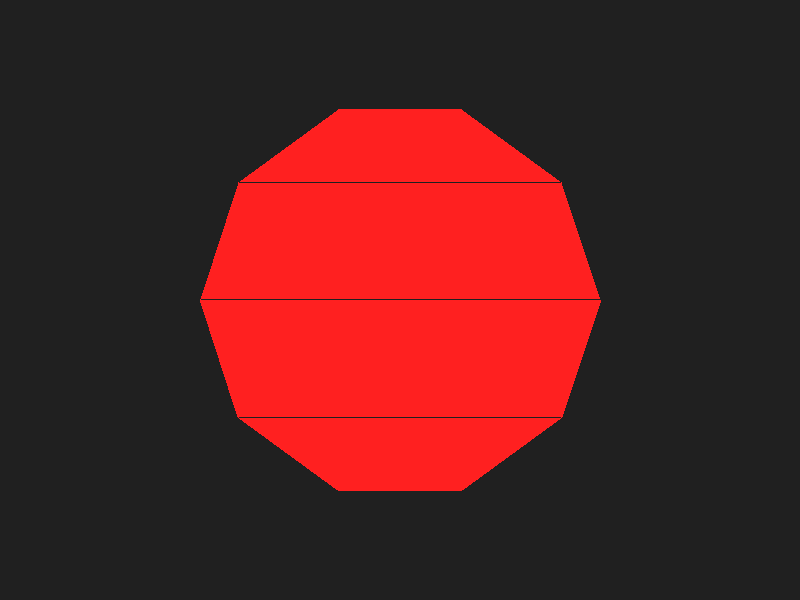
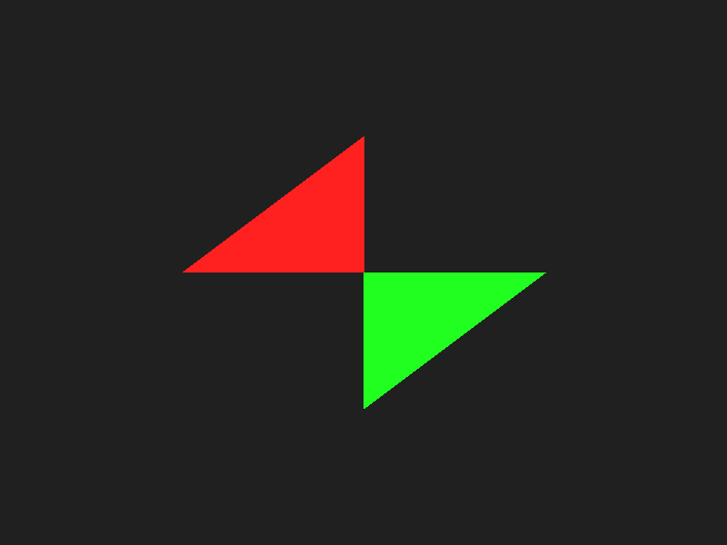
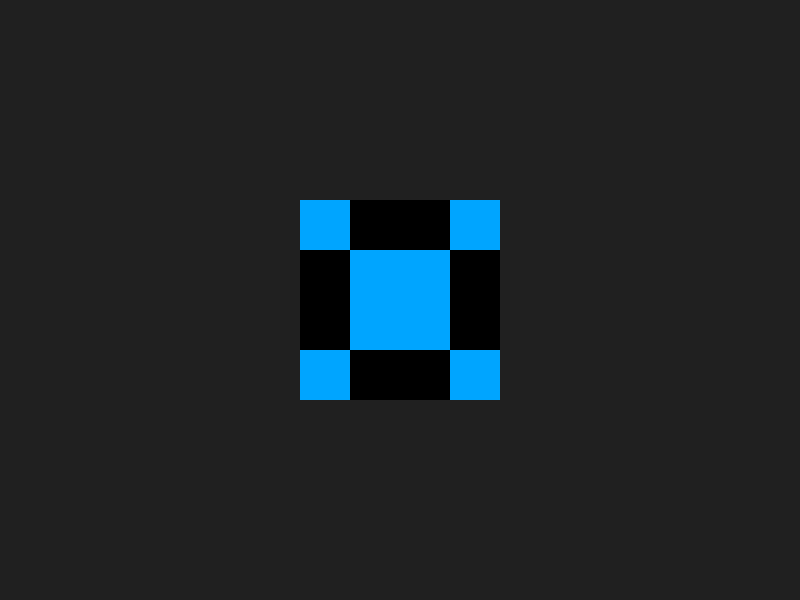
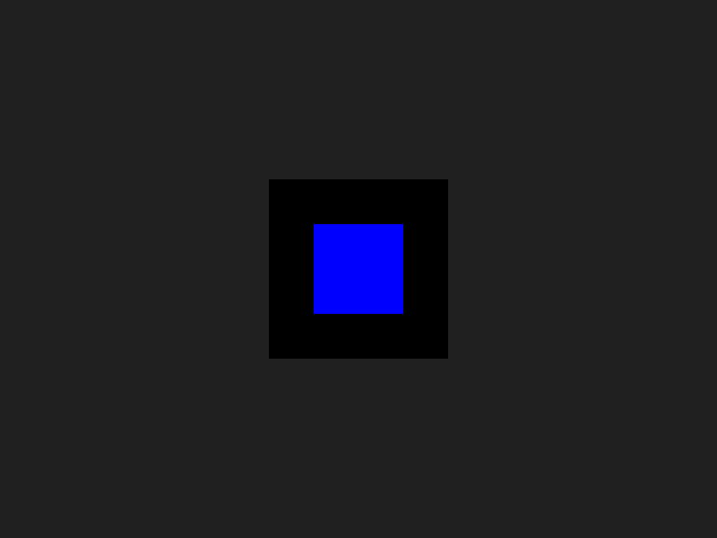

# graphiX.c


graphiX.c is a lightweight 2D graphics library implemented in C, designed to provide basic graphics rendering capabilities and event handling without relying on external graphics libraries. It allows you to create windows, handle keyboard and mouse input, and draw basic shapes and lines.

## Features

- **Event Handling**: Keyboard and mouse input handling
- **Basic Drawing Capabilities**:
  - Draw lines
  - Draw rectangles
  - Draw circles
  - Draw polygon of any side
  - Fill areas with color
  - Sprites rendering
- **Customizable**: Easily extendable for more advanced graphics operations

## Table of Contents

- [Installation](#installation)
- [Usage](#usage)
- [Examples](#examples)
- [Contributing](#contributing)
- [License](#license)
- [Acknowledgments](#acknowledgments)

## Installation

### Prerequisites

- A C compiler (GCC recommended)
- Windows: Windows SDK

### Windows

1. Clone the repository:
    ```sh
    git clone https://github.com/Kraken57/graphiX.c.git
    cd mango
    ```

2. Compile the project:
    ```
  1. Install [Xming](https://sourceforge.net/projects/xming/)
  2. Run `export DISPLAY=:0` in the terminal
  3. Open this repo solution in Visual Studio 2022
  4. Click on Local Window Debugger
  5. run `feh <file_name.ppm>`
  6. Your file will be visible

 
    ```
## Shapes 
 
  






## Usage

### Windows

```c
#include "mangoc_graphics.h"

int main() {
    // Initialize the window and graphics
    initialize_window();
    
    // Main event loop
    while (running) {
        handle_events();
        draw();
    }
    
    // Clean up
    cleanup();
    
    return 0;
}
```

## Examples

### Drawing a Line

```c
mangoc_draw_line(pixels, WIDTH, HEIGHT, 100, 100, 200, 200, 0xFFFFFFFF);
```

### Drawing a Rectangle

```c
mangoc_draw_rectangle(pixels, WIDTH, HEIGHT, 50, 50, 150, 100, 0xFF0000FF);
```

### Drawing a Circle

```c
mangoc_draw_circle(pixels, WIDTH, HEIGHT, 100, 100, 50, 0xFFFF00FF);
```

### Filling an Area

```c
mangoc_fill(pixels, WIDTH, HEIGHT, 0x00FF00FF);
```

